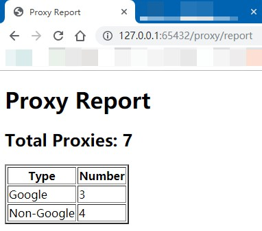
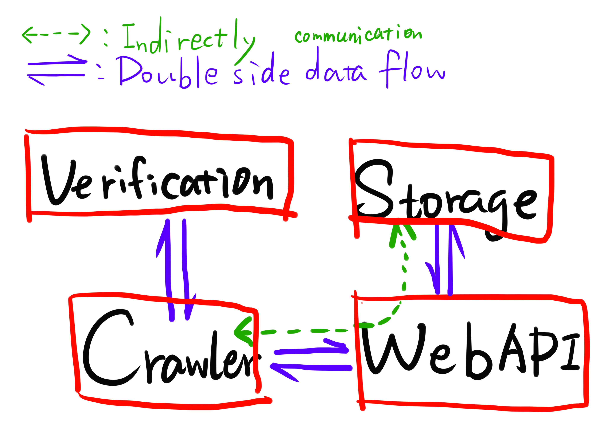

# ProxiesKit

*ProxiesKit* is a pure python based proxy pool server without any outer database.

In most cases, a key-value or RAM database is required for proxy persistence, like Redis and LevelDB. But in some strict environments, these databases cannot be installed on server machines. 

*ProxiesKit* is designed for these cases. It is not good enough to go through high pressure test or run on high performance required conditions, but it is very fast and easy to use on single machine environment.

Hope you can enjoy it.

## Requirements

- Python 3.5 or higher
  - requests==2.22.0
  - flask==1.0.3
  - lxml==4.3.3

## Quick Start

### Installation

First, we have to install some libraries.

```bash
$ pip install requests flask lxml
```

Second, copy `proxieskit` folder to wherever you want.

Done~

### Link Start!

Change directory to `proxieskit` and open bash or command window here.

```bash
$ python run.py
```

And you can open your browser, go to `http://127.0.0.1:65432/proxy/report` to check the working process.

PS. *Google* means the proxy can get Google Translate site here, which is a self-designed verification site. You can change to whatever website you want to test your proxies.



### Configuration

If you find that the API port has been used or you want to deploy it on the Internet instead of local computers, you may need to modify the configuration file.

The config file is `config.py` . The content is shown as below.

If you want to deploy it on a remote server, you'd like to change the `API_IP` into `0.0.0.0` .

You'd better not to change the name of `configger` ,or you may change a lot in somewhere else.

```python
class Config(object):
    API_IP = '127.0.0.1' # server ip
    API_PORT = '65432'	 # server port
    VERIFICATION_TIMEOUT = 1.5 # proxy availability test time
    STORAGE_GOOGLE_UPPER_BOUND = 500	# max storage which can reach self-designed verification sites
    STORAGE_NONGOOGLE_UPPER_BOUND = 500	# max storage of normal proxies
    STORAGE_LOWER_BOUND = 100		# minimum number of proxies
    STORAGE_WATCH_SLEEP_TIME = 60	# check volumn of proxy pool every 60 seconds
    
configger = Config()
```

## Modules

So, here comes the most exciting part: the working mechanisms and modules.

There are four modules in *ProxiesKit* : Crawler, Storage, Verification and WebAPI.



- Crawler: spiders definition, which crawl webpages and parse proxy information
- Storage: provides a python dictionary (map) based database and database operation APIs
- Verification: to make sure the proxies are good to use
- WebAPI: a module to make sure every modules can communicate smoothly

So the basic idea would be: when crawler crawl proxies, crawler will call verification module to verify these proxies. if the proxy is good to use, crawler will save the proxy into database through WebAPI.

### Storage

Every proxy is regarded as a `ProxyInstance` object, when a new `ProxyInstance` object is constructed, `ip`, `port` and `protocol` parameters are required.

`DictDataBase` is the most exciting part, since it is the main database that we'd like to store our proxies. A file-based database or traditional relation databases (sqlite3 especially) can be used here. But a key-value based database is much more faster and easy to maintain. 

All data are structed and  saved as a format of `{"ip-port-protocol": ProxyInstance()}`

Example:

```
{
    "1.2.3.4-3455-http": ProxyInstance(),
    "2.3.4.1-4567-https": ProxyInstance()
}
```

If we save our data into this format, the average operation would be much faster than in a list.

| Algorithm     | Time Complexing |
| ------------- | --------------- |
| Lookup/Update | O(1)            |
| Add           | O(1)            |
| Delete        | O(1)            |
| Sort          | O(N*logN)       |

Class `StoragerMeta` is a database API paradigm, if you'd like to use other databases, you can define your own storage middleware as a derivation of it.

Class `RAMMapStorager` is a storage middleware ( database API ), to connect database in a more user-friendly way.

### WebAPI

Since our database is RAM based, and we want to split these services into different parts of different files, the web service APIs can be a good connector to combine these function modules. 

This module is based on *Flask*: a light python web framework. This framework can give us support on RESTful API constructions, and make the work easier.

The detailed APIs are defined as below:

| API Entry          | Method | Parameters                        | Usage                                                        | Example                                                      | Return                                                       |
| ------------------ | ------ | --------------------------------- | ------------------------------------------------------------ | ------------------------------------------------------------ | ------------------------------------------------------------ |
| /proxy/get_len     | GET    | name (tot \| ggl \| non)          | get the total length of proxy pool; get the length of self-designed verification proxies; get the length of other proxies | GET 127.0.0.1/proxy/get_len?name=tot                         | {"length": 3}                                                |
| /proxy/save        | POST   | ip, port, protocol                | save a proxy into database                                   | POST 127.0.0.1/proxy/get_len?name=tot {'protocol': 'https', 'verified': True, 'speed': 10.0, 'ip': '185.80.130.17', 'google_passed': False, 'anonymity': 'high', 'location': 'lithuania', 'port': '80'} |                                                              |
| /proxy/delete      | GET    | ip, port, protocol                | delete a proxy                                               | GET 127.0.0.1/proxy/delete?ip=1.2.3.4&port=456&protocol=https |                                                              |
| /proxy/find        | GET    | parameters in `ProxyInstance`     | find proxies matching some rules                             | GET /proxy/find?verified=1                                   | [`ProxyInstance()`, `ProxyInstance()`]                       |
| /proxy/get_proxies | GET    | num, google_passed(self-designed) | get numbers of proxies from database with some matching rules | GET /proxy/get_proxies?num=2&google_passed=1                 | [{'http': 'http://1.2.3.4:1234', 'https': 'http://1.2.3.4:1234'}, {{'http': 'http://1.2.3.6:3456', 'https': 'http://1.2.3.6:3456'}}] |
| /proxy/report      | GET    |                                   | to see the status of proxy pool                              |                                                              |                                                              |

 

### Crawler

If you find some good resources to crawl proxies or you have some proxy APIs, you can design your own crawler in `crawler.py` . All the crawlers will be python objects, derived from the class of:  `CrawlerMeta` .

### Verification

In `verification.py`, you can define your own test site. Here, I test the connection to `https://translate.google.cn`, you can change the test site to anything you want.

If the proxy can be reached successfully, the `verified` flag will be set to `True`. If the self-designed site can be crawled successfully, the self-designed flag (e.g. google_passed) will set to `True`.

